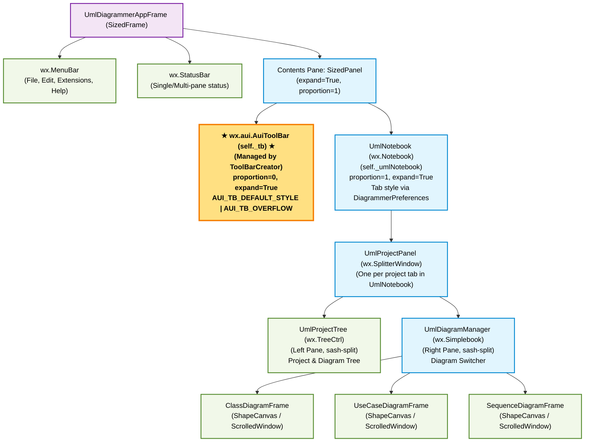
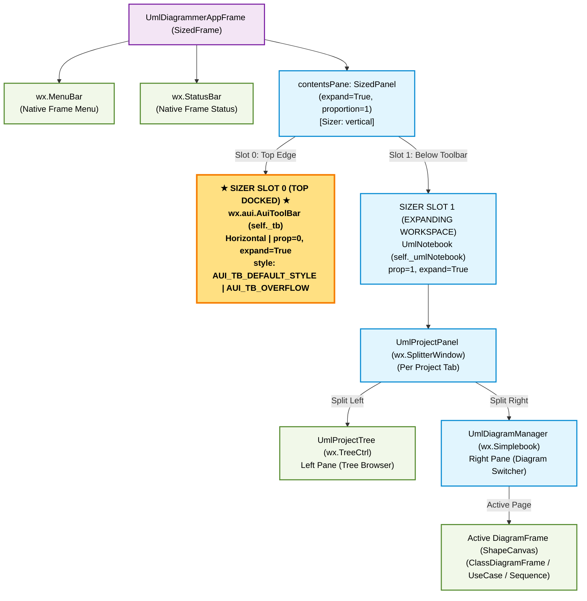
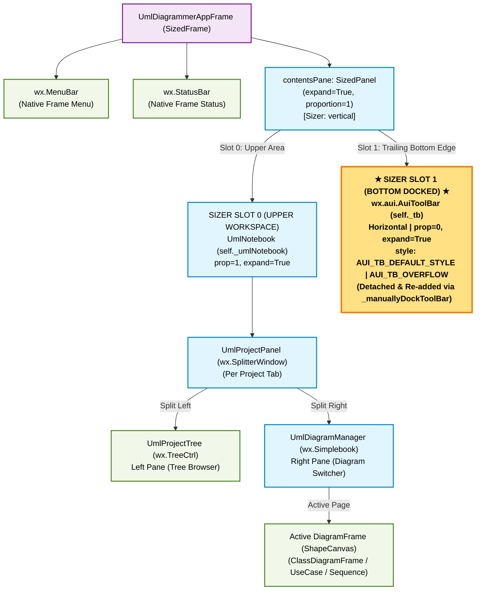
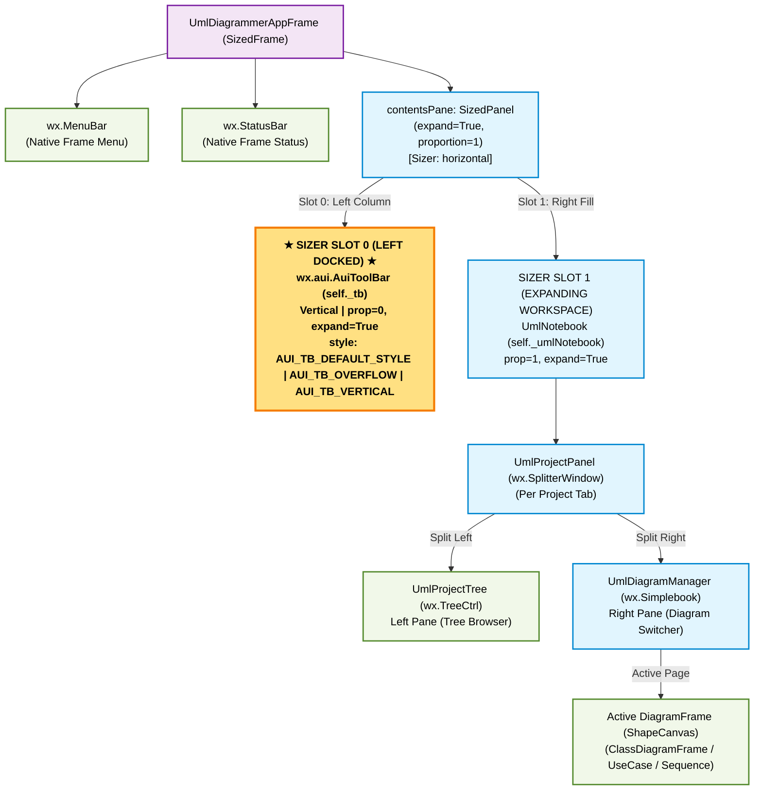
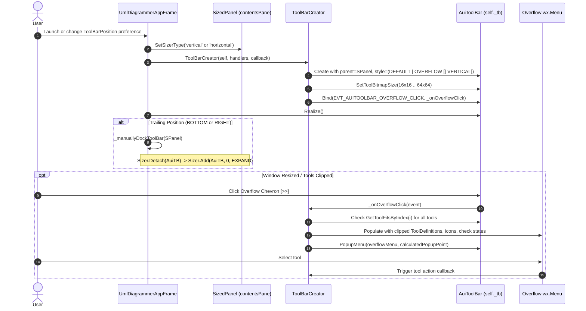

# UML Diagrammer - ToolBar Panel Containment & Layout Architecture

This document details the panel containment hierarchy and layout management used to host and position the custom `AuiToolBar` within `UmlDiagrammerAppFrame`.

---

## 1. Complete Panel Containment Hierarchy Overview

The application frame (`UmlDiagrammerAppFrame`) inherits from `wx.lib.sized_controls.SizedFrame`. Instead of docking the toolbar into native wxFrame toolbar slots via `SetToolBar()`, the toolbar is hosted inside the frame's root `SizedPanel` (`contentsPane`), functioning as a managed sibling to `UmlNotebook`.

---

## 2. Dynamic Sizer Configuration & Containment by Position

The root container (`contentsPane: SizedPanel`) dynamically configures its internal `wx.BoxSizer` based on `preferences.toolBarPosition`.

| ToolBar Position | Sizer Orientation              | Toolbar Style Flags                                          | Sizer Slot 0 (First)      | Sizer Slot 1 (Second)     | Docking Method              |
| :--------------- | :----------------------------- | :----------------------------------------------------------- | :------------------------ | :------------------------ | :-------------------------- |
| **TOP**          | `vertical` (`wx.VERTICAL`)     | `AUI_TB_DEFAULT_STYLE \| AUI_TB_OVERFLOW`                    | **`AuiToolBar`** (prop=0) | `UmlNotebook` (prop=1)    | Natural instantiation order |
| **BOTTOM**       | `vertical` (`wx.VERTICAL`)     | `AUI_TB_DEFAULT_STYLE \| AUI_TB_OVERFLOW`                    | `UmlNotebook` (prop=1)    | **`AuiToolBar`** (prop=0) | `_manuallyDockToolBar()`    |
| **LEFT**         | `horizontal` (`wx.HORIZONTAL`) | `AUI_TB_DEFAULT_STYLE \| AUI_TB_OVERFLOW \| AUI_TB_VERTICAL` | **`AuiToolBar`** (prop=0) | `UmlNotebook` (prop=1)    | Natural instantiation order |
| **RIGHT**        | `horizontal` (`wx.HORIZONTAL`) | `AUI_TB_DEFAULT_STYLE \| AUI_TB_OVERFLOW \| AUI_TB_VERTICAL` | `UmlNotebook` (prop=1)    | **`AuiToolBar`** (prop=0) | `_manuallyDockToolBar()`    |

---

## 3. Position 1: ToolBar Position = TOP

In the **TOP** configuration:
* `contentsPane` uses a `vertical` sizer.
* The highlighted `AuiToolBar` sits in **Sizer Slot 0** (top), while `UmlNotebook` occupies **Sizer Slot 1** (expanding below it).

### Hierarchy Diagram (TOP Position)

### Visual Layout Table (TOP)

| Frame Layer            | Component                             | Sizer Slot & Props          | Visual Layout & Role                                            |
| :--------------------- | :------------------------------------ | :-------------------------- | :-------------------------------------------------------------- |
| **Frame Top**          | `wx.MenuBar`                          | Native Frame Menu           | `File` \| `Edit` \| `Extensions` \| `Help`                      |
| **Slot 0 (Top)**       | **`AuiToolBar`** (`self._tb`)         | `prop=0, expand=True`       | `[★ Horizontal ToolBar ★] [>> Overflow Popup]`                  |
| **Slot 1 (Workspace)** | `UmlNotebook` (`self._umlNotebook`)   | `prop=1, expand=True`       | Tabbed projects container (`[Project 1 Tab *] [Project 2 Tab]`) |
| ↳ *Left Splitter*      | `UmlProjectTree` (`wx.TreeCtrl`)      | `SplitterWindow` Left Pane  | Project & diagrams hierarchy tree browser                       |
| ↳ *Right Splitter*     | `UmlDiagramManager` (`wx.Simplebook`) | `SplitterWindow` Right Pane | Active `DiagramFrame` (`ShapeCanvas` drawing surface)           |
| **Frame Bottom**       | `wx.StatusBar`                        | Native Frame Status         | Multi-pane application status and tool hints                    |

---

## 4. Position 2: ToolBar Position = BOTTOM

In the **BOTTOM** configuration:
* `contentsPane` uses a `vertical` sizer.
* `UmlNotebook` occupies **Sizer Slot 0** (upper workspace).
* When `UmlNotebook` is created, `_manuallyDockToolBar()` detaches `self._tb` and appends it at **Sizer Slot 1** (bottom edge).

### Hierarchy Diagram (BOTTOM Position)

### Visual Layout Table (BOTTOM)

| Frame Layer            | Component                             | Sizer Slot & Props          | Visual Layout & Role                                                        |
| :--------------------- | :------------------------------------ | :-------------------------- | :-------------------------------------------------------------------------- |
| **Frame Top**          | `wx.MenuBar`                          | Native Frame Menu           | `File` \| `Edit` \| `Extensions` \| `Help`                                  |
| **Slot 0 (Workspace)** | `UmlNotebook` (`self._umlNotebook`)   | `prop=1, expand=True`       | Upper workspace; tabbed projects container                                  |
| ↳ *Left Splitter*      | `UmlProjectTree` (`wx.TreeCtrl`)      | `SplitterWindow` Left Pane  | Project & diagrams hierarchy tree browser                                   |
| ↳ *Right Splitter*     | `UmlDiagramManager` (`wx.Simplebook`) | `SplitterWindow` Right Pane | Active `DiagramFrame` (`ShapeCanvas` drawing surface)                       |
| **Slot 1 (Bottom)**    | **`AuiToolBar`** (`self._tb`)         | `prop=0, expand=True`       | `[★ Horizontal ToolBar ★] [>> Overflow Popup]` (via `_manuallyDockToolBar`) |
| **Frame Bottom**       | `wx.StatusBar`                        | Native Frame Status         | Multi-pane application status and tool hints                                |

---

## 5. Position 3: ToolBar Position = LEFT

In the **LEFT** configuration:
* `contentsPane` uses a `horizontal` sizer via `sizedPanel.SetSizerType('horizontal')`.
* `ToolBarCreator` sets the style flag `AUI_TB_VERTICAL`.
* The highlighted `AuiToolBar` sits in **Sizer Slot 0** (left column), and `UmlNotebook` occupies **Sizer Slot 1** (expanding across the remaining width to the right).

### Hierarchy Diagram (LEFT Position)

### Visual Layout Table (LEFT)

| Frame Layer              | Component                             | Sizer Slot & Props          | Visual Layout & Role                                          |
| :----------------------- | :------------------------------------ | :-------------------------- | :------------------------------------------------------------ |
| **Frame Top**            | `wx.MenuBar`                          | Native Frame Menu           | `File` \| `Edit` \| `Extensions` \| `Help` (spans full width) |
| **Slot 0 (Left Column)** | **`AuiToolBar`** (`self._tb`)         | `prop=0, expand=True`       | `[★ Vertical ToolBar ★]` (`AUI_TB_VERTICAL`) docked on left   |
| **Slot 1 (Right Fill)**  | `UmlNotebook` (`self._umlNotebook`)   | `prop=1, expand=True`       | Right workspace filling remaining window width                |
| ↳ *Left Splitter*        | `UmlProjectTree` (`wx.TreeCtrl`)      | `SplitterWindow` Left Pane  | Project & diagrams hierarchy tree browser                     |
| ↳ *Right Splitter*       | `UmlDiagramManager` (`wx.Simplebook`) | `SplitterWindow` Right Pane | Active `DiagramFrame` (`ShapeCanvas` drawing surface)         |
| **Frame Bottom**         | `wx.StatusBar`                        | Native Frame Status         | Multi-pane status and tool hints (spans full width)           |

---

## 6. Position 4: ToolBar Position = RIGHT

In the **RIGHT** configuration:
* `contentsPane` uses a `horizontal` sizer via `sizedPanel.SetSizerType('horizontal')`.
* `ToolBarCreator` sets the style flag `AUI_TB_VERTICAL`.
* `UmlNotebook` occupies **Sizer Slot 0** (left workspace).
* When `UmlNotebook` is created, `_manuallyDockToolBar()` detaches `self._tb` and appends it at **Sizer Slot 1** (right column edge).

### Hierarchy Diagram (RIGHT Position)

### Visual Layout Table (RIGHT)

| Frame Layer               | Component                             | Sizer Slot & Props          | Visual Layout & Role                                                                      |
| :------------------------ | :------------------------------------ | :-------------------------- | :---------------------------------------------------------------------------------------- |
| **Frame Top**             | `wx.MenuBar`                          | Native Frame Menu           | `File` \| `Edit` \| `Extensions` \| `Help` (spans full width)                             |
| **Slot 0 (Left Fill)**    | `UmlNotebook` (`self._umlNotebook`)   | `prop=1, expand=True`       | Left workspace filling remaining window width                                             |
| ↳ *Left Splitter*         | `UmlProjectTree` (`wx.TreeCtrl`)      | `SplitterWindow` Left Pane  | Project & diagrams hierarchy tree browser                                                 |
| ↳ *Right Splitter*        | `UmlDiagramManager` (`wx.Simplebook`) | `SplitterWindow` Right Pane | Active `DiagramFrame` (`ShapeCanvas` drawing surface)                                     |
| **Slot 1 (Right Column)** | **`AuiToolBar`** (`self._tb`)         | `prop=0, expand=True`       | `[★ Vertical ToolBar ★]` (`AUI_TB_VERTICAL`) docked on right (via `_manuallyDockToolBar`) |
| **Frame Bottom**          | `wx.StatusBar`                        | Native Frame Status         | Multi-pane status and tool hints (spans full width)                                       |

---

## 7. AuiToolBar Adjustments & Overflow Handling

To accommodate narrow window dimensions and high-density toolbar items across all 4 docking orientations, `ToolBarCreator` implements several specialized adaptations:

### Key Technical Adaptations
1. **Parentage via `SizedPanel`:**
   Instead of `SetToolBar()` on `wx.Frame`, the `AuiToolBar` is a managed child of `contentsPane`, participating directly in sizer proportion distribution (`prop=0` for toolbar, `prop=1` for `UmlNotebook`).
2. **Overflow Management:**
   Enabling `AUI_TB_OVERFLOW` adds an automatic chevron button when the available window edge cannot fit all tools. `_onOverflowClick` dynamically queries `GetToolFitsByIndex()` to construct a `wx.Menu` that mirrors the hidden tools, their toggle checkmarks, enabled states, and high-resolution icons.
3. **Multi-Resolution Icon Scaling:**
   Toolbar supports icon sizes from Small (16x16), Medium (24x24), Large (32x32), Very Large (48x48), to Extra Large (64x64) via `SetToolBitmapSize()` prior to calling `Realize()`.
4. **Trailing Edge Manual Docking:**
   Because `SizedPanel` manages controls by creation order, `_manuallyDockToolBar()` handles repositioning for `BOTTOM` and `RIGHT` by detaching the toolbar and appending it after the notebook.
